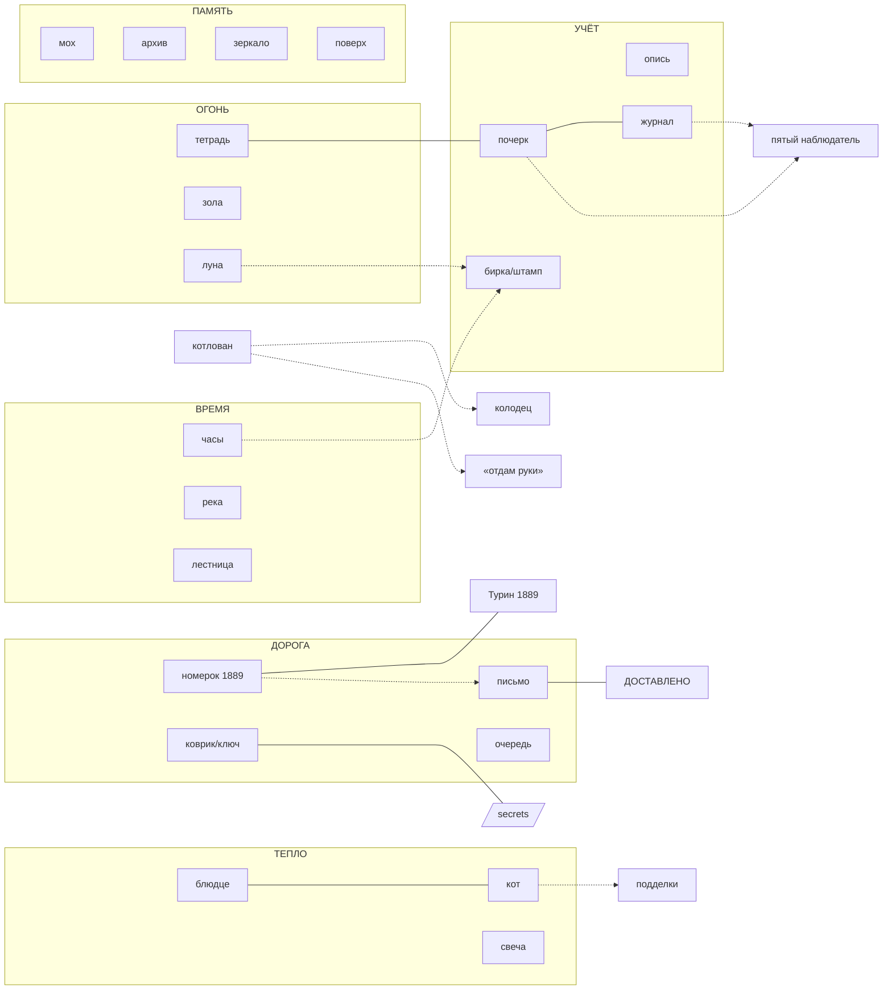

# ОПИСЬ МОТИВОВ И ГРАФ ПЕРЕСЕЧЕНИЙ · ardet
v1 (04.10). Корпус — все тексты игры (2063 текста, ~364 тыс. знаков: осмотры, диалоги,
терминал, лор, таблички, изнанки, клетки мира, фольклор). Числа — сколько текстов
содержат мотив. Голос и дозы — weave/KAMERTON.md.

## Статусы
- **ВОЗДУХ** — мотив везде; это среда, а не нить. Не «пересекаем» — им дышим.
- **НЕСУЩИЙ** — ходит через жанры и кольца и держит смысл.
- **ТЛЕЮЩИЙ** — 5–25 вхождений, вразнобой; просится стать нитью.
- **ОДИНОКИЙ** — 1–4 места, сильный; просится в пересечение.
- **ПРОВАЛ** — канон или картинка обещают, а текста почти нет.

## Опись

| мотив | текстов | где живёт | что несёт | статус |
|---|---|---|---|---|
| огонь / горит / пожар | 170 | клетки, осмотры, лор, терминал | конец, который всё идёт | ВОЗДУХ |
| опись / учёт / ведомость | 162 | таблички фонда, клетки, прикрытие | канцелярия верует | ВОЗДУХ |
| окно / витрина | 96 | клетки, таблички, постройки | показ вместо жизни | НЕСУЩИЙ |
| поверх / закрашено / штукатурка | 81 | клетки, таблички, постройки | мир пишет по прошлому | НЕСУЩИЙ |
| дверь | 80 | изнанки, клетки, таблички | вход для своих, второй вход | НЕСУЩИЙ |
| часы / стрелки | 68 | клетки, таблички | время стоит или изъято | НЕСУЩИЙ |
| бирка · штамп | 63 · 55 | клетки, таблички | вещь становится документом | НЕСУЩИЙ |
| мох / мицелий | 54 | лор, терминал, осмотры | память, которая переживёт учёт | НЕСУЩИЙ |
| журнал | 48 | клетки, таблички | учёт событий без событий | НЕСУЩИЙ |
| архив | 46 | лор, клетки, терминал | хранение как исчезновение | НЕСУЩИЙ |
| лестница / ступени | 45 | изнанки, осмотры | спуск, «девять» | ТЛЕЮЩИЙ |
| письмо / конверт / доставлено | 43 | клетки, таблички, фольклор | доставка без адресата | НЕСУЩИЙ |
| тень | 37 | клетки, фольклор | — | ТЛЕЮЩИЙ |
| река / Гераклит | 35 | клетки, фольклор | время-спираль | НЕСУЩИЙ |
| свеча | 32 | клетки, таблички | единственный тёплый свет | ТЛЕЮЩИЙ |
| фонарь / Диоген | 27 | клетки, фольклор | ищу человека | ТЛЕЮЩИЙ |
| кот | 25 | осмотры, изнанки, фольклор | идёт к настоящему теплу | ТЛЕЮЩИЙ (а в каноне — ключевой) |
| почерк | 25 | осмотры, изнанки, таблички | кто ведёт запись | ТЛЕЮЩИЙ → кандидат в главную нить |
| зеркало / «с задержкой» | 24 | Sol, лор, «Линия» | мир — копия с опозданием | ТЛЕЮЩИЙ |
| блюдце | 23 | палатка, сейд, лор | подношение коту и неведомому | ТЛЕЮЩИЙ |
| снег · зола / пепел | 25 · 25 | клетки | север / остаток огня | ТЛЕЮЩИЙ |
| очередь | 20 | таблички фонда | порядок вместо цели | ТЛЕЮЩИЙ |
| колодец | 13 | клетки, таблички | глубина без воды | ТЛЕЮЩИЙ |
| мериты / автомат | 13 | терминал, лор | радость в развлечение | ТЛЕЮЩИЙ |
| радио | 15 | терминал, улица | «запись продолжается» | ТЛЕЮЩИЙ |
| котлован | 8 | Дворец Советов, лор, Платонов | глубже вера — дальше дом | ОДИНОКИЙ (кластер) |
| тетрадь | 5 | алтарь церкви, печь Гоголя ×3 | рукопись, принятая огнём | ОДИНОКИЙ |
| номерок 1889 / пальто | 4+6 | театр, гардероб | зритель ещё в зале | ОДИНОКИЙ (уже с нитью) |
| ключ под ковриком | 4 | пиццерия, /secrets, «GREGOR» | вход, который не прячут | ОДИНОКИЙ (уже с нитью) |
| **луна** | **4** | костёр, лор | красная луна — печать мира | **ПРОВАЛ** |
| **птицы** | **11** | разрозненно | стая у луны в стиле | **ПРОВАЛ** |
| пятый наблюдатель | 0 в текстах | в коде — кот (`silentCat.js`: «SILENT CAT — 5th Watcher», открывается после 4 встреч) | кот смотрит молча | канон в коде; в текстах — молчит, и это верно |
| хлеб · соль · спички | 2 · 7 | — | быт, которого нет | ПРОВАЛ (для шёпотов) |
| Сизиф | 3 | лор, терминал, фольклор | труд без итога | ОДИНОКИЙ |

## Пересечения, которые уже есть (находки корпуса)

1. **Номерок 1889 ↔ Турин.** Театр: «пальто тяжёлое, туринское. Номерок 1889». Терминал,
   досье Ницше: «03.01.1889, Турин». Фольклор: спектакль не кончится, пока пальто не
   востребовано. Две вещи объясняют друг друга, и ни одна этого не говорит. **Эталон пересечения.**
2. **Коврик → ключ → «GREGOR».** Пиццерия: ключ под ковриком «Welcome»; терминал
   `/secrets`: «.pizzeria_key [найден под ковриком]»; у другой двери коврик «GREGOR».
3. **Тетрадь.** Алтарь без крыши: тетрадь в чёрной обложке. Печь в доме с мезонином: пепел
   тетради, бирка «сожжено: том второй, 1 шт.» — трижды по миру. Старец: «на страницах —
   твой почерк».
4. **Письмо без адресата.** «ПЕРЕДАТЬ, ЕСЛИ НЕ ВЕРНУСЬ» + штамп «ДОСТАВЛЕНО»; «АДРЕСАТ
   ВЫБЫЛ»; фольклор: «недоставленных писем не бывает — бывают адресаты, которые ещё в пути».
5. **Котлован.** Дворец Советов (котлован после взрыва храма), лор «Котлован копали 14 лет»,
   досье Платонова, клетка «утопию строили как котлован».
6. **Блюдце.** Монеты в блюдце под сейдом, блюдце у палатки Старца, «кот сел на блюдце».
7. **Почерк.** Книга смен: «без происшествий», почерк каждый раз новый; протокол: «тихо»,
   оба раза разным почерком; у Старца — «твой почерк».

## Граф

Сплошная линия — пересечение уже есть; пунктир — предлагается.

## Предлагаемые пересечения

Каждое — две-три вещи в разных местах, которые объясняют друг друга. Связь видит
только тот, кто побывал везде.

**П1 · Почерк → пятый наблюдатель (главная нить).** У Старца — «на страницах твой
почерк». Добавить 3–4 места, где запись сделана тем же почерком: журнал вышки, графа
«осмотрено» в книге выдачи, подпись под актом. Ни один текст не говорит «это ты».
Вместе они говорят: опись ведёт странник. Это закрывает провал «пятого наблюдателя» и
даёт основу номеру дела в стриме. *(Набросок, журнал вышки:)* «Наблюдателей — 4.
Наблюдение ведётся. Запись ведёт пятый; почерк сверен с журналом Старца.»

**П2 · Луна — закрыть провал.** Красная луна — печать мира, а в тексте её четыре раза.
Дать ей две-три бирки канцелярии в разных местах. *(Набросок:)* «Луна, 1 шт. Цвет не по
нормативу. Замена запрошена. Ответ: луна единственная, замены нет.»

**П3 · Номерок → письмо.** Номерок 1889 выдают в театре; на почте в другом кольце лежит
письмо «до востребования», выдают только по номерку. Предмет из одного места
открывает текст в другом — как в Fallout. Письмо — короткое, без адресата.

**П4 · Часы изымают по кольцам.** Эталон «изъяты как вызывающие беспокойство» как нить:
в журнале канцелярии растёт строка «часы изъяты» от кольца к кольцу; на кольце 9 — табло
без времени. Время прячут тем аккуратнее, чем ближе огонь.

**П5 · Кот — детектор настоящего.** Канон: кот идёт к настоящему теплу. У потёмкинских
фасадов кота нет никогда, у настоящих печей — есть (у оранжереи и серверного ангара он
уже сидит). Плюс досье `whois КОТ` (эталон 7). Внимательный игрок сам начнёт проверять
подделки котом.

**П6 · Платоновский кластер.** Котлован (кольцо 7) ↔ колодец, где «пить не пили, но
крутили исправно» (эталон 1) ↔ объявление «ОТДАМ В ХОРОШИЕ РУКИ — РУКИ… уволен по
причине задумчивости» (эталон 8) — на одной равнине, в шаге друг от друга. Ни один не
называет Платонова; вместе это «Котлован».

**П7 · Шёпоты — быт прошлого.** Провал «хлеб, соль, спички» — материал для шёпотов
нового принципа (эталон 12): соль кончилась, дверь не заперта, спички «если ещё дают».

## Правила пересечений
1. Пересечение — две вещи, которые объясняют друг друга, а не одно слово дважды.
2. Ни один текст не называет связь. Её видит только тот, кто был в обоих местах.
3. Мотив меняется по кольцам: часы стоят → изъяты → табло; письмо → телеграмма → уведомление.
4. Нить — 3–5 вхождений на весь мир. Больше — это уже не находка, а обои.
5. ВОЗДУХ (огонь, опись) нитью не делаем: им дышат все тексты.

## Сделано (04.10, выбор автора: П1, П3, П5)
- **П1 · почерк → кто ведёт опись** (поправка: пятый наблюдатель в каноне — кот, поэтому
  нить ведёт не к «пятому», а к записи, которую ведёт странник). Вхождения: Старец «твой
  почерк» (автор, не трогали); вышка «Почерк не Архивариуса» (было); протокол замера
  у Лунного «оба раза разным почерком. Второй ты узнаёшь»; театр, гардероб «В книге
  выдачи — подпись принявшего. Рука знакомая»; `whois you` «почерк: сверен. расхождений нет».
- **П3 · номерок → письмо** (src/world/threads.js). В газовом переулке (кольцо 6, запад),
  рядом с ящиком, где лежит письмо «отцу» со штемпелем «НЕ ОТПРАВЛЯТЬ», — окно
  «до востребования». Без театра: «Без номерка письма не выдаются, даже тем, кому они
  адресованы». Кто видел номерок 1889 в театре, называет его и получает конверт со
  штемпелем Турина: «В сущности, каждое имя в истории — это я» (Ницше, письмо Буркхардту,
  6 января 1889), подпись неразборчива; бирка «Пальто остаётся за зрителем до конца
  спектакля». Перекликается с `whois you`: «странник / архивариус / модель / мох».
- **П5 · кот — детектор настоящего.** `whois КОТ` / `whois cat` (эталон 7). Кот у
  настоящего тепла: оранжерея, серверный ангар (было), кочегарка «Камчатка» у люка,
  дом с печью на заслонке (новое). У потёмкинского фасада: «Кошачьих следов нет ни у
  одной двери». Плюс молчаливый кот-наблюдатель в городке (код).

## Сделано, волна 2 (04.10, утверждено автором)
- **П2 · луна:** бирка у костра (городок, src/world/threads2.js): «Луна, 1 шт. Цвет не по
  нормативу. Замена запрошена». Ниже: «Ответ: луна единственная, замены нет». Ещё ниже: «Приказы
  руководства не обсуждаются» (строка автора). `whois луна` / `moon`.
- **П4 · часы по кольцам:** 5 — десятичные часы у ратуши; 7 — гвоздь и светлый прямоугольник,
  бирка «…изъяты как вызывающие беспокойство»; 9 — табло «--:--», «Точное время предоставляется
  по подписке».
- **П6 · платоновский кластер:** у котлована Дворца Советов — колодец («пить не пили, но крутили
  исправно») и объявление «ОТДАМ В ХОРОШИЕ РУКИ — РУКИ…» (эталоны).
- **П7 · шёпоты-быт:** у бирки луны, табло, колодца; у озера — вместо отсылки к убранному плакату.
- Досье героев и файлы для мёртвых ссылок терминала (weave/perel/terminal_gaps.md): Шут, Sol,
  Старец, Архивариус, Лунный, мох, луна; .moss, .ardet (read), .pizzeria_key, .cat_saucer,
  .archivist_log, .moss_weights.
